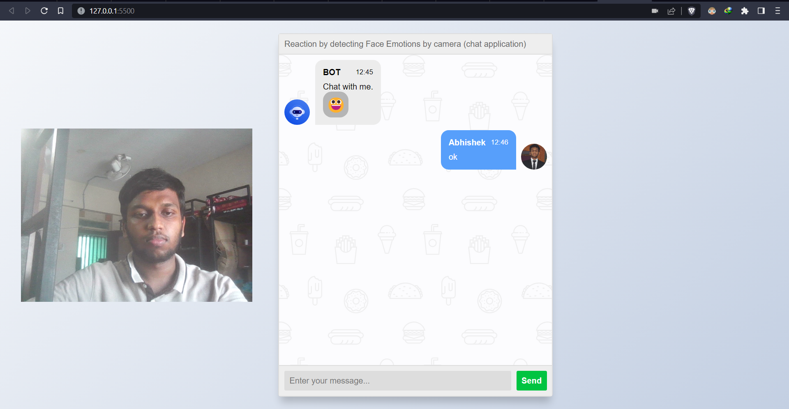
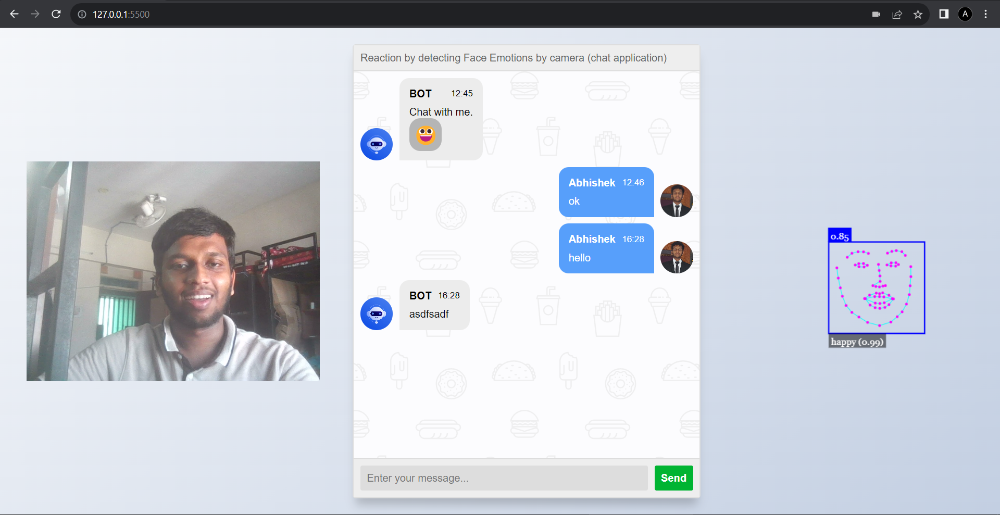
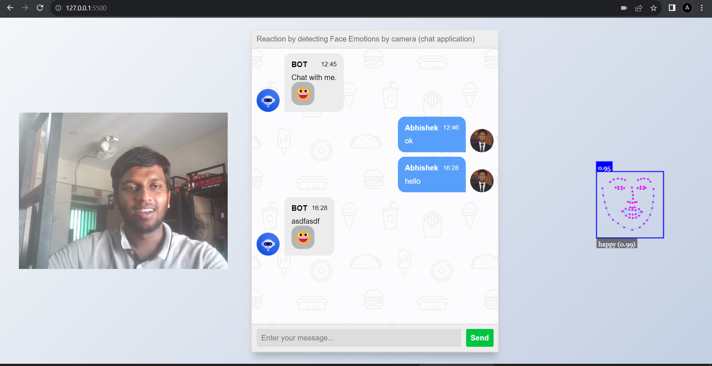

<h1>This project provides automated emoji reaction by detecting face emotions in chat</h1>
 
<h2>Screenshots (user camera image and ml model image can be hidden)</h2>

<h3>Home page</h3>

 
<h3>While calculating emotions</h3>

 
<h3>Updation of emoji in chat</h3>
